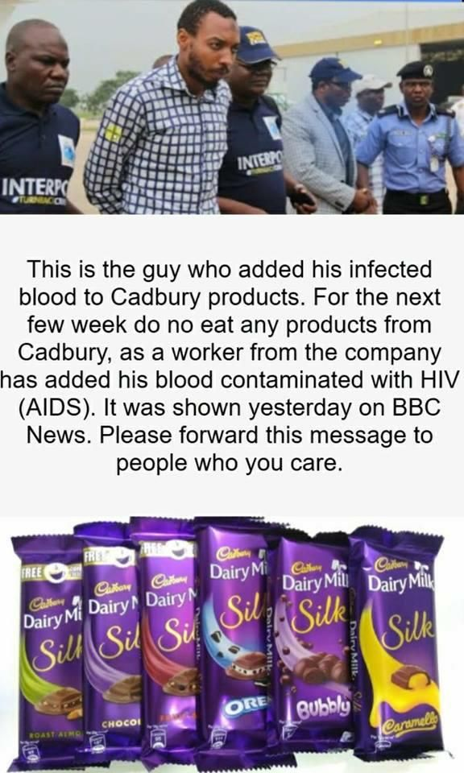
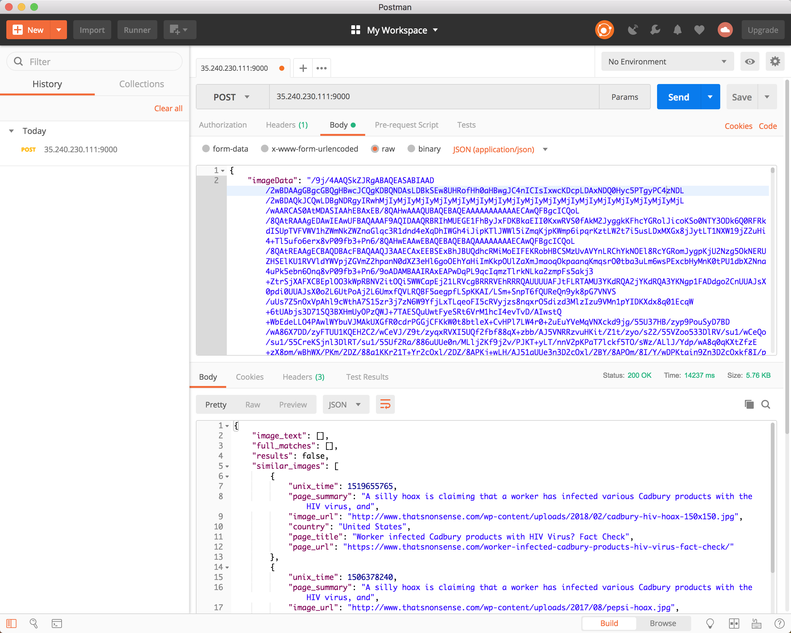

# Web Image Analytics Tool
First developed at a Design Sprint @ [Trusted Media Summit 2018](https://events.withgoogle.com/apac-trusted-media-summit-2018/)


## Overview

### User journey
The user wants to check an image-meme that is being circulated on social media or messaging platforms. The image-memes looks something like this.



He downloads the image-meme into his picture library. Then he opens up our web-app and uploads the image-meme to the web app. 

The web-app provides a default cropping region. The drags the cropping tool so that it covers exactly the picture. There are also options to flip the image and/or rotate the image.


The user confirms the crop. The image is sent to an online server, where cropping is done. Then the server relays the cropped image to Google Vision API for reverse image search. We receive results from Google Vision API. 

## Technical Details
The repository will be run by the server. The input is an image and cropping instructions, and the output is relevant information regarding the image. 

### Quick Install Guide

Prerequisites:

* Ubuntu environment is preferred
* python3-dev python3-pip python3-tk
* 

1. `git clone https://github.com/tlkh/webimages-analytics-tool`
2. `sudo pip3 install -r requirements.txt`
3. Follow the [instructions to set up Cloud Vision authentication](https://cloud.google.com/vision/docs/libraries#client-libraries-install-python) in your environment
4. `python3 server.py -p 9000` to run the server at `localhost:9000`
5. Test your server with Postman

### The INPUT
Our server will receive a JSON file. 

```
{
    "imageData": "sk\djgdfku\h\s\kfh...in..base64",
    "x": "0",
    "y": "0",
    "width": "32", 
    "height": "100",
    "scaleX": "0",
    "scaleY": "0",
    "rotate": "90",
    "lang": "en"
}
```

The JSON file contains imageData, which is the image in base64 format, and cropping instructions contains the starting xy coordinates and the width and height. `lang` is the language of the caption, and having the correct input to the field does greatly improving OCR Language support. The list of supported languages is available here: https://cloud.google.com/vision/docs/languages

### The PROCESS
We will first parse the JSON file with `do_POST` in `server.py` into a Python dictionary. This Python dictionary is then passed into `parse_crop_instructions` in `image_processing.py`, and it returns a cropped image, which is a numpy array. This numpy array is sent to Google Cloud Vision API. 

The Google Cloud Vision API will return a JSON file containing information about the picture. A demonstration is available on their site. https://cloud.google.com/vision/ The critical information we want is the related images, as well as the date of publishing. As the API does not return information regarding the publishing date, we worked around it by sending a javascript console request `alert(document.lastModified)` URL hosting the image. We return the time in unix_time format so to allow sorting to be done more easier on the front-end. We will also use a newspaper module to make a summary, and it is part of our output.

Then we will consolidate the information and return the web-app a JSON file.

### The OUTPUT
This is the result when the full image_meme is being selected.

```
{
    "full_matches": [],
    "image_text": [],
    "best_guess": [
        "cadbury hiv"
    ],
    "similar_images": [
        {
            "unix_time": 1532591855,
            "country": "United States",
            "page_url": "https://www.snopes.com/fact-check/cadbury-hiv-arrest/",
            "page_title": "FACT CHECK: Are Cadbury Products Contaminated with HIV?",
            "page_summary": "CLAIMA worker at Cadbury plant was arrested for contaminating the company's products with HIV-infected blood.\nRATINGORIGINClaiming that various company's food products have somehow become contaminated with HIV/AIDS has been a prevalent form of hoax for many years, targeting foodstuffs from pineapples to canned goods to soft drinks.\nA more recent wrinkle in that decades-old trope posited in 2018 that an employee of Cadbury, a British multinational confectionery company, was arrested for "adding his HIV-infected blood" to the company's products:This rumor was nothing more than a variant of an old hoax that was previously aimed at Pepsi, with virtually no difference other than the substitution of one company's name for another's:No warnings have been issued, nor any arrests made, in conjunction with a supposed HIV contamination of Cadbury products, and as we noted in a similar previous article, the possibility of such an occurrence's taking place is low to non-existent:",
            "image_url": "https://i1.wp.com/verifykhabar.com/wp-content/uploads/2018/03/Cadbury-HIV-arrested.jpg"
        },
        {
            "unix_time": 1520426192,
            "country": "United States",
            "page_url": "https://www.snopes.com/fact-check/cadbury-hiv-arrest/",
            "page_title": "FACT CHECK: Are Cadbury Products Contaminated with HIV?",
            "page_summary": "CLAIMA worker at Cadbury plant was arrested for contaminating the company's products with HIV-infected blood.\nRATINGORIGINClaiming that various company's food products have somehow become contaminated with HIV/AIDS has been a prevalent form of hoax for many years, targeting foodstuffs from pineapples to canned goods to soft drinks.\nA more recent wrinkle in that decades-old trope posited in 2018 that an employee of Cadbury, a British multinational confectionery company, was arrested for "adding his HIV-infected blood" to the company's products:This rumor was nothing more than a variant of an old hoax that was previously aimed at Pepsi, with virtually no difference other than the substitution of one company's name for another's:No warnings have been issued, nor any arrests made, in conjunction with a supposed HIV contamination of Cadbury products, and as we noted in a similar previous article, the possibility of such an occurrence's taking place is low to non-existent:",
            "image_url": "https://www.ayupp.com/img/news/15204cadbury_product_viral.jpg"
        },
        {
            "unix_time": 1520070577,
            "country": "France",
            "page_url": "https://www.snopes.com/fact-check/cadbury-hiv-arrest/",
            "page_title": "FACT CHECK: Are Cadbury Products Contaminated with HIV?",
            "page_summary": "CLAIMA worker at Cadbury plant was arrested for contaminating the company's products with HIV-infected blood.\nRATINGORIGINClaiming that various company's food products have somehow become contaminated with HIV/AIDS has been a prevalent form of hoax for many years, targeting foodstuffs from pineapples to canned goods to soft drinks.\nA more recent wrinkle in that decades-old trope posited in 2018 that an employee of Cadbury, a British multinational confectionery company, was arrested for "adding his HIV-infected blood" to the company's products:This rumor was nothing more than a variant of an old hoax that was previously aimed at Pepsi, with virtually no difference other than the substitution of one company's name for another's:No warnings have been issued, nor any arrests made, in conjunction with a supposed HIV contamination of Cadbury products, and as we noted in a similar previous article, the possibility of such an occurrence's taking place is low to non-existent:",
            "image_url": "https://hoax-net.be/wp-content/uploads/2018/02/2018-HIV-3.jpg"
        }
    ],
    "partial_matches": [
        {
            "unix_time": 1532579640,
            "country": "United States",
            "page_url": "https://www.snopes.com/fact-check/cadbury-hiv-arrest/",
            "page_title": "FACT CHECK: Are Cadbury Products Contaminated with HIV?",
            "page_summary": "CLAIMA worker at Cadbury plant was arrested for contaminating the company's products with HIV-infected blood.\nRATINGORIGINClaiming that various company's food products have somehow become contaminated with HIV/AIDS has been a prevalent form of hoax for many years, targeting foodstuffs from pineapples to canned goods to soft drinks.\nA more recent wrinkle in that decades-old trope posited in 2018 that an employee of Cadbury, a British multinational confectionery company, was arrested for "adding his HIV-infected blood" to the company's products:This rumor was nothing more than a variant of an old hoax that was previously aimed at Pepsi, with virtually no difference other than the substitution of one company's name for another's:No warnings have been issued, nor any arrests made, in conjunction with a supposed HIV contamination of Cadbury products, and as we noted in a similar previous article, the possibility of such an occurrence's taking place is low to non-existent:",
            "image_url": "https://us-east-1.tchyn.io/snopes-production/uploads/2017/08/pepsicrime.jpg"
        },
        {
            "unix_time": 1532573962,
            "country": "United States",
            "page_url": "https://www.snopes.com/fact-check/cadbury-hiv-arrest/",
            "page_title": "FACT CHECK: Are Cadbury Products Contaminated with HIV?",
            "page_summary": "CLAIMA worker at Cadbury plant was arrested for contaminating the company's products with HIV-infected blood.\nRATINGORIGINClaiming that various company's food products have somehow become contaminated with HIV/AIDS has been a prevalent form of hoax for many years, targeting foodstuffs from pineapples to canned goods to soft drinks.\nA more recent wrinkle in that decades-old trope posited in 2018 that an employee of Cadbury, a British multinational confectionery company, was arrested for "adding his HIV-infected blood" to the company's products:This rumor was nothing more than a variant of an old hoax that was previously aimed at Pepsi, with virtually no difference other than the substitution of one company's name for another's:No warnings have been issued, nor any arrests made, in conjunction with a supposed HIV contamination of Cadbury products, and as we noted in a similar previous article, the possibility of such an occurrence's taking place is low to non-existent:",
            "image_url": "https://us-east-1.tchyn.io/snopes-production/uploads/2018/02/cadburyhiv.jpg"
        }
    ]
}
```

<!---
This is the result when the individual image is being selected.
```
{
    "full_matches": [],
    "image_text": [],
    "best_guess": [
        "cadbury hiv"
    ],
    "partial_matches": [
        {
            "country": "United States",
            "unix_time": 1532579640,
            "image_url": "https://us-east-1.tchyn.io/snopes-production/uploads/2017/08/pepsicrime.jpg"
        },
        {
            "country": "United States",
            "unix_time": 1532573962,
            "image_url": "https://us-east-1.tchyn.io/snopes-production/uploads/2018/02/cadburyhiv.jpg"
        }
    ],
    "similar_images": [
        {
            "country": "United States",
            "unix_time": 1532591855,
            "image_url": "https://i1.wp.com/verifykhabar.com/wp-content/uploads/2018/03/Cadbury-HIV-arrested.jpg"
        },
        {
            "country": "United States",
            "unix_time": 1520426192,
            "image_url": "https://www.ayupp.com/img/news/15204cadbury_product_viral.jpg"
        },
        {
            "country": "United States",
            "unix_time": 1520070577,
            "image_url": "https://hoax-net.be/wp-content/uploads/2018/02/2018-HIV-3.jpg"
        }
    ]
}
```
-->

### Case of Zero Results
We will return the following result:


<!--- 

# Functions featured

# Objective

This module contains code that is used to process images for the front end. 

This was started from the mess that we created from three different repos: <BR>
https://github.com/tonghuikang/fake-news-image-analysis/ <BR>
https://github.com/tlkh/fake-news-image-analysis <BR>
https://github.com/tlkh/reverse-image-search <BR>
https://github.com/tonghuikang/edited-photo-autoencoder

## Definitions
"image-meme" - the article that is being circulated around. It may have multiple "images", with overlaying text and or captions. In the example above, there are two images, with captioning text sandwiched in the middle.

## Basic image functions
These are simple functions that has already been implemented in popular libraries already. We are bringing them to this platform. It is assumed these images are a numpy array.

### Flipping
Given image, process (mirror vertical or horizontal, flip vertical or horizontal). This may improve reverse image search results.

### Cropping
Given image, and (x,y,w,h) coordinates, return the cropped image.

### Color adjustment
Given image and some instructions (to be specified) adjust the colour. This is a feature requested by fact-checkers.
The color scheme (RGB, RBG or HSV) is only relevant when readjusting the color.

## Intermediate level functions
These functions may have more than one way to do it.

### Smart Crop
Given an image-meme overlaid or captioned with text, crop out the image. Currently our method with OpenCV offers some success. Demonstration here https://github.com/tonghuikang/fake-news-image-analysis/blob/master/segment_analysis.ipynb and https://github.com/tlkh/fake-news-image-analysis/blob/master/segment_analysis.ipynb.

## Image search
Issues with Google Vision API. https://cloud.google.com/vision/ 
The Google Vision is not optimised for fact checkers. Fact checkers are interested in the earliest original photo. Google tends to give the most popular search result. 

### Find the date
At the image, we can send a javascript console request (is that what it is called???) - `alert(document.lastModified)`. However, it is possible that this can be fooled. 

-->

# How to install
```
git clone https://github.com/tonghuikang/tms-2018-images/
cd tms-2018-images/
sudo bash ./install.sh
```
Meanwhile, create your Google Cloud API key on https://cloud.google.com/docs/authentication/production
Copy its contents into `key.json`. 

# How to run
In the same folder, run `python3 server.py`. You should see this line:
```Thu Jul 26 15:16:28 2018 Server Starts - 0.0.0.0:9000```

We will use Postman to test APIs. If the response is as expected, the front end should receive the same response as well. I shall not explain step by step installation as I managed to get it work by seeing Timothy (the main contributor to this repo) doing it. It is best to show how it is done with a picture.


You can see an IP address and its port. The IP address is the Google Cloud VM's IP address, which you can retrived from the Compute Engine console. In the first large text box it an field for JSON entry. In the screenshot it contains a JSON POST example `./JSON_examples/example_POST.json`. I pressed the blue send button, and after some time it returns the second large text box. The details and specifications of the input and output JSON file is elaborated in the eariler sections.

# Additional information

## Design Sprint Brief by Irene

> ABSTRACT
>
> The information ecosystem has been polluted by “fake news”, whether that’s the inadvertent sharing of false information (misinformation) or the deliberate creation and sharing of information known to be false (disinformation).
> Today, fact-checkers use a variety of web-based tools to verify misinformation. While effective, these tools are relatively old, disparate and for the most part desktop-only, a significant barrier for fact checkers and journalists from mobile-first/mobile-only countries such as India, Indonesia and the Philippines. In addition, most of these tools were not purpose-built for verification, but have been adopted by the verification community for lack of better options.
> There is a great opportunity not only to update these tools, but to reimagine what these tools could/ should do for the explicit purpose of verification, leveraging the latest technologies (including Google Vision API, Google Natural Language, Google Maps API, etc) and optimized for mobile.
> A group comprising verification experts, UX designers, Cloud engineers, ML specialists and full stack developers will participate in a design sprint to build a mobile-optimized photo verification tool.
> 
> SPRINT CHALLENGE
>
> Create a single tool that seamlessly integrates all of the tools and techniques used to verify photographs, including but not limited to reverse image search, exif data, crop, geolocation, extraction of keywords or landmarks - optimized for mobile.
> Goal: The final output will a working prototype that integrates new technologies, built to reflect the workflow used verification experts and/ or regular users to verify photos
> 
> FINAL DELIVERABLES
> 
> Working prototype which can undergo user testing

## Future Work 
These are not part of our prototype, but are very achievable functions that could be devised and integrated into our platform.

### Image Artefacts Removal
Following is a complaint by fact-checkers: When images added with added artefacts (such as arrows) are fed into Google reverse image search, images with the same added artefacts are returned. The intention was to find the original picture without the artefacts. However, as the edited picture is far more popular than the original picture, the original picture is buried deep within the search result. 

There is value in removing artefacts through machine learning. Similar work has been done to fill up missing patches of any picture with autoencoders. The current progress can be seen here. The removal of arrows and "warning" text has been quite successful: https://github.com/tlkh/edited-photo-autoencoder

### Universal Meme Segmentation
An example-based solution (machine learning) to image segmentation is appreciated. Our working experiment used a rule-based solution with OpenCV. <!-- Include an explanation of the method? -->
